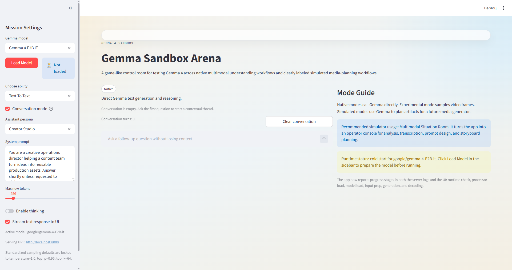
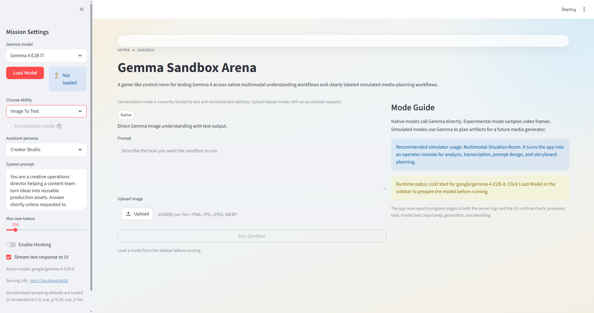

# Gemma Sandbox Arena

A local-first sandbox for exploring multimodal AI models through text, image, audio, and video understanding workflows. Currently built around Google Gemma 4, with a serving research toolkit for benchmarking and capacity planning.

The UI and model-serving backend communicate through a generic `POST /generate` API, so swapping or adding models (Llama, Phi, Mistral, etc.) only requires changes inside `model-serving/`.

## Repository Layout

| Folder | Purpose | Entry point |
|---|---|---|
| `model-serving/` | FastAPI model-serving backend (loads Gemma, exposes `/generate` and job endpoints) | `uvicorn gemma_serving.app:app` |
| `ui/` | Streamlit sandbox UI (calls model-serving over HTTP) | `streamlit run ui/app.py` |
| `playground/` | Standalone demo and benchmark scripts | Individual `.py` files |

Each project has its own `requirements.txt`, `.env.example`, and `PYTHONPATH` root.

## Hardware Recommendations

Gemma 4 inference performance depends heavily on having a CUDA-capable GPU. CPU-only inference is functional but too slow for interactive or production use.

### Check Your GPU

Before getting started, verify what GPU (if any) your system has:

| OS | Command |
|---|---|
| **Windows (PowerShell)** | `Get-CimInstance Win32_VideoController \| Select-Object Name, AdapterRAM, DriverVersion` |
| **macOS** | `system_profiler SPDisplaysDataType` |
| **Linux** | `lspci \| grep -i vga` or `nvidia-smi` (if NVIDIA drivers are installed) |

### Measured CPU-Only Baseline

These results were collected on a Windows machine with no CUDA GPU, using default FP32 weights and `max_new_tokens=192`:

| Model | Task | Latency per request |
|---|---|---|
| Gemma 4 E2B | Text-only listing rewrite | ~35–43 seconds |
| Gemma 4 E4B | Text-only listing rewrite | ~77–101 seconds |

**Verdict:** CPU-only inference is usable for offline batch work but not for interactive or multi-user serving.

### Recommended GPU Tiers

#### Gemma 4 E2B (smallest, lowest cost)

| GPU | VRAM | Expected text-rewrite latency | Notes |
|---|---|---|---|
| NVIDIA RTX 3060 12 GB | 12 GB | 2–5 seconds | Budget entry point, fits E2B in FP16 |
| NVIDIA RTX 4060 Ti 16 GB | 16 GB | 1.5–4 seconds | More headroom for longer prompts |
| NVIDIA T4 (cloud) | 16 GB | 2–5 seconds | Free tier on Colab, cheapest cloud option |

#### Gemma 4 E4B (recommended default)

| GPU | VRAM | Expected text-rewrite latency | Notes |
|---|---|---|---|
| NVIDIA RTX 4070 Ti 12 GB | 12 GB | 3–6 seconds | May need 8-bit quantization to fit |
| NVIDIA RTX 3090 / 4080 | 16–24 GB | 2–5 seconds | Comfortable fit in FP16 |
| NVIDIA A10G (cloud) | 24 GB | 2–4 seconds | Good cloud option, ~$0.75/hr spot |
| NVIDIA L4 (cloud) | 24 GB | 2–4 seconds | Available on GCP, efficient inference card |

#### Gemma 4 26B A4B / 31B (not recommended for low-cost)

These models require 40–80 GB VRAM (A100, H100 class) and are not practical for local or budget deployments.

### Cost-Effective Strategies

1. **Start with E2B on a 12–16 GB GPU.** Validate rewrite quality before investing in larger hardware.
2. **Use quantization (8-bit or 4-bit)** to fit larger models on smaller GPUs, at a small quality cost.
3. **Use cloud GPU spot instances** (Colab T4 free tier, Lambda Labs, RunPod, Vast.ai) for experimentation before buying hardware.
4. **Reduce `max_new_tokens`** to lower latency. Many listing rewrites complete well under 192 tokens.
5. **Keep image analysis asynchronous.** Multimodal requests are 2–3× slower than text-only; queue them as background jobs.
6. **Cache repeated rewrites.** The FastAPI blueprint includes an in-memory cache to avoid re-running identical requests.

### Example Machine Setups

#### Machine A — Laptop (RTX 2000 Ada, 8 GB VRAM)

```
NVIDIA RTX 2000 Ada Generation Laptop GPU   8 GB VRAM
AMD Radeon(TM) Graphics                     (integrated, not usable)
```

- **Below the 12 GB minimum** for even the smallest model (E2B) in FP16.
- With **4-bit quantization** (`GEMMA_QUANTIZE_4BIT=1`), E2B drops to ~1.5–2 GB VRAM and **fits comfortably**. See [4-Bit Quantization](#4-bit-quantization) below.
- E4B in 4-bit (~4–5 GB) is possible but tight — may OOM on longer prompts.
- Without quantization, this machine is **CPU-only territory** (~35–43 s per rewrite).

#### Machine B — Desktop (RTX 3090, 24 GB VRAM)

```
NVIDIA GeForce RTX 3090   24 GB VRAM
Intel(R) UHD Graphics 750 (integrated, not usable)
```

- **Ideal for local interactive use.** Fits Gemma 4 E4B comfortably in FP16 with room to spare.
- Expected text-rewrite latency: **2–5 seconds**.
- Can also run E2B with headroom for longer contexts or multimodal inputs.
- No quantization needed.

### Minimum Hardware Summary

| Deployment Goal | Minimum GPU | Minimum VRAM | Model |
|---|---|---|---|
| Local prototyping | RTX 3060 | 12 GB | E2B |
| Local interactive use | RTX 3090 / 4080 | 16–24 GB | E4B |
| Cloud serving (low cost) | T4 / L4 | 16–24 GB | E2B or E4B |
| Production 100-user serving | Multiple L4 / A10G workers | 24 GB each | E4B |

### GPU Detection & Usage

**No manual flags needed.** The model-serving backend auto-detects CUDA GPUs at load time:

- If `torch.cuda.is_available()` is `True`, models load with `device_map="auto"` and `bfloat16` precision — the GPU is used automatically.
- If no CUDA GPU is found, models fall back to CPU with `float32`.

You can verify CUDA is available before starting the server:

```bash
python -c "import torch; print(f'CUDA available: {torch.cuda.is_available()}, Device: {torch.cuda.get_device_name(0) if torch.cuda.is_available() else \"CPU\"}')"
```

If this prints `CUDA available: False` despite having an NVIDIA GPU, ensure you have the correct [PyTorch CUDA build](https://pytorch.org/get-started/locally/) installed (`pip install torch --index-url https://download.pytorch.org/whl/cu124`).

### 4-Bit Quantization

The model-serving backend supports NF4 quantization via [bitsandbytes](https://github.com/TimDettmers/bitsandbytes), which reduces VRAM usage by ~4× at a small quality cost. This is how lower-VRAM GPUs (8–12 GB) can run models that would otherwise not fit.

**Enable it** by setting the `GEMMA_QUANTIZE_4BIT` environment variable before starting the server:

```powershell
# PowerShell
$env:GEMMA_QUANTIZE_4BIT = "1"
uvicorn gemma_serving.app:app
```

```bash
# bash / zsh
GEMMA_QUANTIZE_4BIT=1 uvicorn gemma_serving.app:app
```

**Prerequisite:** install `bitsandbytes`:

```bash
pip install bitsandbytes
```

**Approximate VRAM usage with 4-bit quantization:**

| Model | FP16 VRAM | 4-bit NF4 VRAM | Fits on 8 GB GPU? |
|---|---|---|---|
| Gemma 4 E2B | ~5–6 GB | ~1.5–2 GB | Yes |
| Gemma 4 E4B | ~9–10 GB | ~4–5 GB | Tight, may OOM on long prompts |

**How it works** (`gemma_service.py` → `_build_model_load_kwargs`):
- When `GEMMA_QUANTIZE_4BIT=1`, a `BitsAndBytesConfig(load_in_4bit=True, bnb_4bit_quant_type="nf4")` is passed to `from_pretrained()`.
- Compute dtype remains `bfloat16` on CUDA, so inference math stays in half-precision while weights are stored in 4-bit.
- `device_map="auto"` still applies — the GPU is used automatically.

## Screenshots

### Main View — Text-to-Text Mode
Sidebar shows the **Load Model** button, **Assistant persona** dropdown, and editable **System prompt**. The Run Sandbox button stays disabled until a model is loaded.


### Conversation Mode
Enabling **Conversation mode** replaces the prompt box with a chat input that keeps prior turns in context. The "Clear conversation" button resets the thread.



### Image-to-Text Mode with Upload
Switching the ability to **Image To Text** shows a file uploader for PNG/JPG/JPEG/WEBP images alongside the prompt.



## Tests

All tests pass on Python 3.9+.

**UI tests** (5/5 passed):
```
tests/test_prompts.py::test_text_prompt_returns_user_input              PASSED
tests/test_prompts.py::test_persona_presets_include_concise_instruction PASSED
tests/test_prompts.py::test_simulation_prompt_marks_non_native_mode     PASSED
tests/test_prompts.py::test_ability_specs_label_simulated_modes         PASSED
tests/test_sandbox_service.py::test_text_run_includes_prior_conversation_messages PASSED
```

**Model-serving tests** (14/14 passed — tests requiring `torch`/GPU skipped locally):
```
tests/test_benchmarking.py::test_run_benchmark_returns_summary          PASSED
tests/test_benchmarking.py::test_load_scenarios_parses_request_mode     PASSED
tests/test_benchmarking.py::test_simulate_capacity_returns_e2b_and_e4b  PASSED
tests/test_planning.py::test_traffic_profile_exposes_concurrency        PASSED
tests/test_planning.py::test_estimate_concurrent_requests               PASSED
tests/test_planning.py::test_estimate_worker_throughput                 PASSED
tests/test_planning.py::test_estimate_required_workers_rounds_up        PASSED
tests/test_planning.py::test_estimate_cost_per_request                  PASSED
tests/test_planning.py::test_estimate_concurrent_requests_validates_inputs PASSED (x3)
tests/test_planning.py::test_estimate_worker_throughput_validates_latency PASSED
tests/test_planning.py::test_estimate_required_workers_validates_inputs  PASSED
tests/test_planning.py::test_estimate_cost_per_request_validates_inputs  PASSED
```

## Quick Start

```bash
# Clone and create a virtual environment
python -m venv venv
venv\Scripts\Activate.ps1   # Windows PowerShell
# source venv/bin/activate  # Linux/macOS

# Install dependencies for both projects
pip install -r model-serving/requirements.txt
pip install -r ui/requirements.txt

# Copy and configure environment for each project
cp model-serving/.env.example model-serving/.env
# Edit model-serving/.env to set GEMMA_MODEL_ID and GEMMA_FASTAPI_GATEWAY
cp ui/.env.example ui/.env
# Edit ui/.env to set SERVING_URL if not using default http://localhost:8000

# Start the model-serving API (terminal 1)
cd model-serving
$env:PYTHONPATH = "src"          # Windows PowerShell
# export PYTHONPATH=src          # Linux/macOS
uvicorn gemma_serving.app:app --host 127.0.0.1 --port 8000

# Start the UI (terminal 2)
cd ui
$env:PYTHONPATH = "src"          # Windows PowerShell
# export PYTHONPATH=src          # Linux/macOS
streamlit run app.py
```

## Serving Research Toolkit

The `playground/` directory contains standalone tools for benchmarking and capacity planning:

```bash
# Run simulated benchmark harness validation
python playground/benchmark_runner.py model-serving/tests/scenarios.json

# Run real Gemma inference benchmarks
$env:PYTHONPATH = "model-serving\src"   # Windows PowerShell
python playground/benchmark_runner.py model-serving/docs/scenarios/ebay-listing-benchmarks.json \
  --target gemma_serving.benchmark_targets:benchmark_listing_rewrite

# Run E2B vs E4B concurrency simulation
python playground/concurrency_simulation.py --registered-users 100 --active-request-rate 0.1 --multimodal-share 0.2
```

## Documentation

- [docs/START_HERE.md](docs/START_HERE.md) — Project entrypoint and restart guide
- [docs/tasks.md](docs/tasks.md) — Task tracking and phase status
- [docs/design/design.md](docs/design/design.md) — Architecture and design decisions
- [docs/research/gemma4-serving-evaluation.md](docs/research/gemma4-serving-evaluation.md) — Model selection and serving research
- [docs/research/low-cost-fastapi-blueprint.md](docs/research/low-cost-fastapi-blueprint.md) — Queue-first FastAPI blueprint design

## License

See repository for license details.
