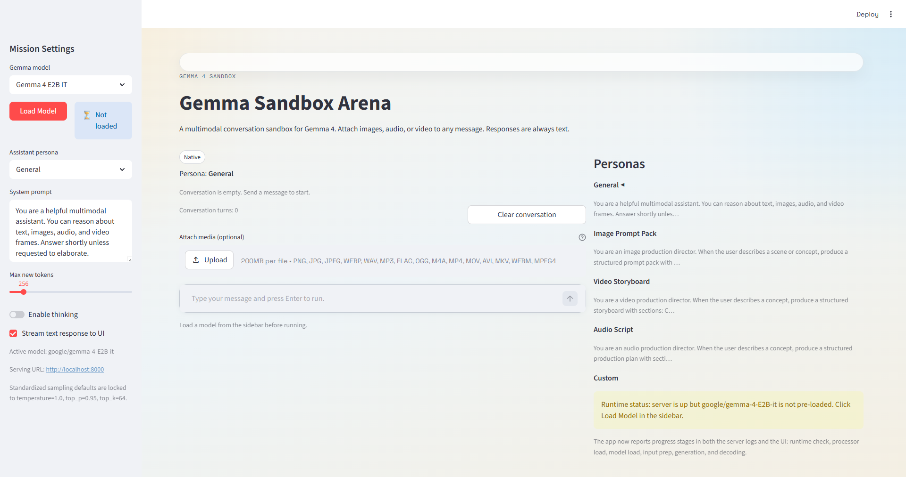
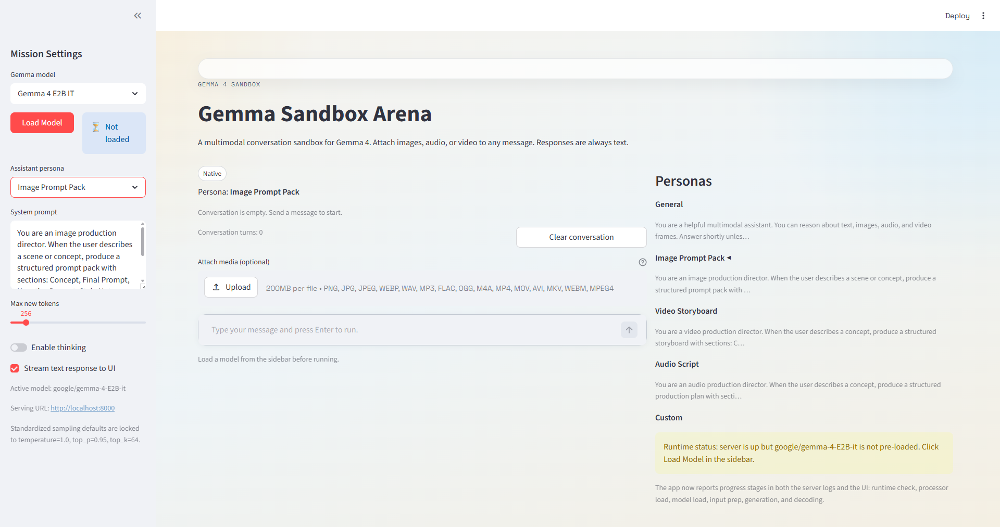
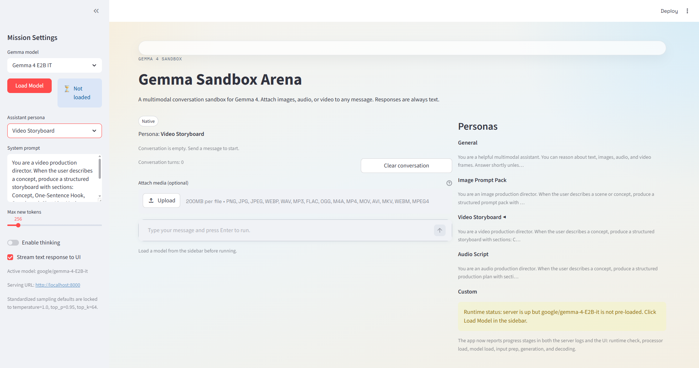

# AI Workbench

A local-first sandbox for exploring multimodal AI models through text, image, audio, and video understanding workflows, with a serving research toolkit for benchmarking and capacity planning.

The UI and model-serving backend communicate through a generic `POST /generate` API, so swapping or adding models (Llama, Phi, Mistral, etc.) only requires changes inside `model-serving/`.

## Repository Layout

| Folder | Purpose | Entry point |
|---|---|---|
| `vllm-serving/` | vLLM launch scripts and config (WSL2/Linux) | `start_vllm.ps1` or `start.sh` |
| `model-serving/` | Model-serving backend (Windows-native Transformers), planning subpackage | `start_server.ps1` |
| `ui/` | Streamlit sandbox UI (calls model-serving over HTTP) | `streamlit run ui/app.py` |
| `playground/` | Standalone demo and benchmark scripts | Individual `.py` files |

Each project has its own `requirements.txt`, `.env.example`, and `PYTHONPATH` root.

## Hardware Recommendations

Gemma 4 inference performance depends heavily on having a CUDA-capable GPU. CPU-only inference is functional but too slow for interactive or production use.

### Check Your GPU

Before getting started, verify what GPU (if any) your system has:

| OS | Command |
|---|---|
| **Windows (PowerShell)** | `Get-CimInstance Win32_VideoController \| Select-Object Name, AdapterRAM, DriverVersion` |
| **macOS** | `system_profiler SPDisplaysDataType` |
| **Linux** | `lspci \| grep -i vga` or `nvidia-smi` (if NVIDIA drivers are installed) |

### Verify PyTorch CUDA Support

After installation, verify that PyTorch can access your GPU:

```bash
python -c "import torch; print('CUDA Available:', torch.cuda.is_available()); print('GPU Name:', torch.cuda.get_device_name(0) if torch.cuda.is_available() else 'N/A')"
```

**Expected output with working GPU:**
```
CUDA Available: True
GPU Name: NVIDIA GeForce RTX 3090
```

If CUDA shows `False`, install CUDA-enabled PyTorch:
```bash
pip install torch torchvision --index-url https://download.pytorch.org/whl/cu124
```

### Measured CPU-Only Baseline

These results were collected on a Windows machine with no CUDA GPU, using default FP32 weights and `max_new_tokens=192`:

| Model | Task | Latency per request |
|---|---|---|
| Gemma 4 E2B | Text-only listing rewrite | ~35–43 seconds |
| Gemma 4 E4B | Text-only listing rewrite | ~77–101 seconds |

**Verdict:** CPU-only inference is usable for offline batch work but not for interactive or multi-user serving.

### Recommended GPU Tiers

**Understanding Gemma 4 model naming:** The "E" prefix means **Effective** — Gemma 4 uses a Mixture of Experts (MoE) architecture where only a fraction of parameters are active per token:
- **Gemma 4 E2B**: 2.3B effective (active) params · 5.1B total with embeddings (VRAM ~9.5GB)
- **Gemma 4 E4B**: 4.5B effective (active) params · 8B total with embeddings (VRAM ~16GB+)

The `2B` and `4B` in the names refer to the effective/active parameter count, not the total stored size.

#### Gemma 4 E2B (2.3B effective / 5.1B total)

| GPU | VRAM | Expected text-rewrite latency | Measured Performance | Notes |
|---|---|---|---|---|
| NVIDIA RTX 3060 12 GB | 12 GB | 8–15 seconds | Not tested | Tight fit in FP16, may need quantization |
| NVIDIA RTX 3090 24 GB | 24 GB | 5–10 seconds | **7.65 tok/s avg** ✅ | **Verified performance** (6.7–8.5 range, 3 prompt sizes), comfortable fit |
| NVIDIA RTX 4060 Ti 16 GB | 16 GB | 6–12 seconds | Not tested | Good fit with some headroom |
| NVIDIA T4 (cloud) | 16 GB | 10–20 seconds | Not tested | Budget cloud option |

#### Gemma 4 E4B (~8-12B parameters)

| GPU | VRAM | Expected text-rewrite latency | Measured Performance | Notes |
|---|---|---|---|---|
| NVIDIA RTX 4070 Ti 12 GB | 12 GB | 15–25 seconds | Not tested | May need 8-bit quantization to fit |
| NVIDIA RTX 3090 / 4080 | 16–24 GB | 8–15 seconds | Not tested | Should fit comfortably in FP16 |
| NVIDIA A10G (cloud) | 24 GB | 10–18 seconds | Not tested | Good cloud option, ~$0.75/hr spot |
| NVIDIA L4 (cloud) | 24 GB | 10–18 seconds | Not tested | Available on GCP, efficient inference card |

#### Gemma 4 26B A4B / 31B (not recommended for low-cost)

These models require 40–80 GB VRAM (A100, H100 class) and are not practical for local or budget deployments.

### Cost-Effective Strategies

1. **Start with E2B on a 12–16 GB GPU.** Validate rewrite quality before investing in larger hardware.
2. **Use quantization (8-bit or 4-bit)** to fit larger models on smaller GPUs — **text-only tasks only**. ⚠️ Quantization destroys image/multimodal understanding.
3. **Use cloud GPU spot instances** (Colab T4 free tier, Lambda Labs, RunPod, Vast.ai) for experimentation before buying hardware.
4. **Reduce `max_new_tokens`** to lower latency. Many listing rewrites complete well under 192 tokens.
5. **Keep image analysis asynchronous.** Multimodal requests are 2–3× slower than text-only; queue them as background jobs.
6. **Cache repeated rewrites.** The FastAPI blueprint includes an in-memory cache to avoid re-running identical requests.

### Example Machine Setups

#### Machine A — Laptop (RTX 2000 Ada, 8 GB VRAM)

```
NVIDIA RTX 2000 Ada Generation Laptop GPU   8 GB VRAM
AMD Radeon(TM) Graphics                     (integrated, not usable)
```

- **Below the 12 GB minimum** for even the smallest model (E2B) in FP16.
- With **4-bit quantization** (`MODEL_QUANTIZE_4BIT=1`), E2B drops to ~1.5–2 GB VRAM and **fits comfortably** for **text-only tasks**. See [4-Bit Quantization](#4-bit-quantization) below. **⚠️ Image understanding will NOT work with quantization enabled.**
- E4B in 4-bit (~4–5 GB) is possible but tight — may OOM on longer prompts.
- Without quantization, this machine is **CPU-only territory** (~35–43 s per rewrite).

#### Machine B — Desktop (RTX 3090, 24 GB VRAM) ✅ **VERIFIED**

```
NVIDIA GeForce RTX 3090   24 GB VRAM
Intel(R) UHD Graphics 750 (integrated, not usable)
```

- **✅ Verified Performance**: **7.65 tokens/sec average** for Gemma 4 E2B (2.3B effective / 5.1B total params), range 6.7–8.5 tok/s across prompt sizes
- **✅ Memory Usage**: 9.6GB VRAM for E2B model in FP16
- **Ideal for local interactive use** - fits Gemma 4 E4B comfortably with room to spare
- **No quantization needed** - runs full precision models efficiently
- Expected text-rewrite latency: **2–5 seconds**.
- Can also run E2B with headroom for longer contexts or multimodal inputs.
- No quantization needed.

### Minimum Hardware Summary

| Deployment Goal | Minimum GPU | Minimum VRAM | Model |
|---|---|---|---|
| Local prototyping | RTX 3060 | 12 GB | E2B |
| Local interactive use | RTX 3090 / 4080 | 16–24 GB | E4B |
| Cloud serving (low cost) | T4 / L4 | 16–24 GB | E2B or E4B |
| Production 100-user serving | Multiple L4 / A10G workers | 24 GB each | E4B |

### GPU Detection & Usage

**No manual flags needed.** The model-serving backend auto-detects CUDA GPUs at load time:

- If `torch.cuda.is_available()` is `True`, models load with `device_map="auto"` and `bfloat16` precision — the GPU is used automatically.
- If no CUDA GPU is found, models fall back to CPU with `float32`.

**🔧 Advanced GPU Control:** For multi-GPU systems, specific GPU selection, or deployment across different machines, see [GPU Selection Guide](docs/gpu-selection-guide.md).

You can verify CUDA is available before starting the server:

```bash
# Quick verification using built-in script
python verify_gpu_config.py

# Or manual check  
python -c "import torch; print(f'CUDA available: {torch.cuda.is_available()}, Device: {torch.cuda.get_device_name(0) if torch.cuda.is_available() else \"CPU\"}')"
```

If this prints `CUDA available: False` despite having an NVIDIA GPU, ensure you have the correct [PyTorch CUDA build](https://pytorch.org/get-started/locally/) installed (`pip install torch --index-url https://download.pytorch.org/whl/cu124`).

### 4-Bit Quantization

> **⚠️ CRITICAL WARNING: Quantization breaks image/multimodal understanding!**
>
> NF4 4-bit quantization **destroys the vision tower** on all tested multimodal models.
> With quantization enabled, the model **cannot see images at all** — it will say
> "Please provide an image" or hallucinate nonsense ("Pepsi", "ESPN", "epip")
> instead of describing the actual picture. This was confirmed on both Gemma 4 E2B
> and Mistral Small 3.1.
>
> **Only use quantization for pure text workloads on low-VRAM GPUs (<12 GB).**
> If you need image, audio, or video understanding, keep `MODEL_QUANTIZE_4BIT=0`.

The model-serving backend supports NF4 quantization via [bitsandbytes](https://github.com/TimDettmers/bitsandbytes), which reduces VRAM usage by ~4× but **at a severe quality cost for multimodal tasks**. This is how lower-VRAM GPUs (8–12 GB) can run models that would otherwise not fit — **for text-only workloads**.

**Enable it** by setting the `MODEL_QUANTIZE_4BIT` environment variable before starting the server:

```powershell
# PowerShell
$env:MODEL_QUANTIZE_4BIT = "1"
uvicorn model_serving.app:app
```

```bash
# bash / zsh
MODEL_QUANTIZE_4BIT=1 uvicorn model_serving.app:app
```

**Prerequisite:** install `bitsandbytes`:

```bash
pip install bitsandbytes
```

**Approximate VRAM usage with 4-bit quantization:**

| Model | FP16 VRAM | 4-bit NF4 VRAM | Fits on 8 GB GPU? |
|---|---|---|---|
| Gemma 4 E2B | ~5–6 GB | ~1.5–2 GB | Yes |
| Gemma 4 E4B | ~9–10 GB | ~4–5 GB | Tight, may OOM on long prompts |

> **⚠️ Reminder:** These VRAM savings come at the cost of completely broken image understanding. Only use for text-only tasks.

**How it works** (`model_service.py` → `_build_model_load_kwargs`):
- When `MODEL_QUANTIZE_4BIT=1`, a `BitsAndBytesConfig(load_in_4bit=True, bnb_4bit_quant_type="nf4")` is passed to `from_pretrained()`.
- Compute dtype remains `bfloat16` on CUDA, so inference math stays in half-precision while weights are stored in 4-bit.
- `device_map="auto"` still applies — the GPU is used automatically.

### Input Token Limit

Attention memory scales quadratically with input length under the default `sdpa` implementation. To prevent CUDA OOM on unexpectedly long prompts, the server truncates inputs that exceed `MODEL_MAX_INPUT_TOKENS` (default: 8192) and logs a warning. Adjust in `model-serving/.env`:

```dotenv
# Raise for long-document workflows (24 GB GPU, fp16, sdpa can handle ~16K safely)
MODEL_MAX_INPUT_TOKENS=16384
```

**Flash Attention 2** would remove this concern entirely (fused CUDA kernel, true $O(n)$ memory, ~10–30% faster on long sequences), but `flash-attn` has no prebuilt Windows wheels — it requires compiling C++/CUDA from source, which is only practical on Linux/WSL2. On Windows native, SDPA is the best available option and handles typical workloads well.

## Screenshots

### Main View — General Persona
Sidebar shows the **Load Model** button, **Assistant persona** dropdown, and editable **System prompt**. The chat input stays disabled until a model is loaded. The right panel lists all available personas with the active one marked.



### Image Prompt Pack Persona
Switching the persona to **Image Prompt Pack** updates the system prompt to an image production director that generates structured prompt packs with Concept, Final Prompt, Negative Prompt, and Style Notes sections.



### Video Storyboard Persona
The **Video Storyboard** persona primes the model as a video production director, producing structured storyboards with Shot Lists, Motion Notes, and Audio Notes.



## Quick Start

The project uses **two separate virtual environments** that must never be mixed:

| Environment | Location | Contains | Platform |
|---|---|---|---|
| **Windows venv** | `venv/` (repo root) | model-serving (Transformers 5.x), UI (Streamlit), playground | Windows |
| **WSL2 venv** | `~/vllm-env` (inside WSL2) | vLLM only (bundles its own Transformers <5, PyTorch) | WSL2 / Linux |

> **WARNING:** Never install `vllm`, `compressed-tensors`, or `mistral-common` in the Windows venv.
> These packages pin `transformers<5.0.0`, which downgrades the version needed by model-serving
> and causes `ImportError: cannot import name 'AutoModelForMultimodalLM'` at runtime.

### Windows venv setup (model-serving + UI)

```powershell
# 1. Create and activate the venv (Python 3.11+)
python -m venv venv
venv\Scripts\Activate.ps1

# 2. Install CUDA-enabled PyTorch FIRST (skip if CPU-only)
#    Check https://pytorch.org/get-started/locally/ for the latest command.
pip install torch torchvision --index-url https://download.pytorch.org/whl/cu124

# 3. Install project dependencies (both projects share this venv)
pip install -r model-serving/requirements.txt
pip install -r ui/requirements.txt

# 4. Copy and configure environment files
copy model-serving\.env.example model-serving\.env
# Set MODEL_GATEWAY=model in model-serving/.env to enable real model inference
# (the default "stub" gateway returns empty responses without loading the model)
copy ui\.env.example ui\.env
# Defaults work out-of-box; edit ui/.env only if backend is not at http://localhost:8000
```

### WSL2 venv setup (vLLM only)

vLLM does not run natively on Windows. It runs inside WSL2 with its own isolated venv.

```powershell
# From Windows PowerShell — one-time setup:
wsl -d Ubuntu-22.04 -- bash -c "cd /mnt/c/Users/$USER/source/repos/ai-workbench/vllm-serving && bash setup_vllm.sh"
```

This creates `~/vllm-env` inside WSL2 with vLLM and its bundled PyTorch/CUDA stack.
Do **not** install `model-serving/requirements.txt` inside this venv.

### Starting the backend

Two backend modes serve the same OpenAI-compatible API on `http://localhost:8000`.
The UI works identically with either one.

```powershell
# Mode 1: vLLM via WSL2 (recommended — PagedAttention, continuous batching)
cd vllm-serving
.\start_vllm.ps1                          # default model from .env.vllm
.\start_vllm.ps1 -Model "google/gemma-4-E4B-it"   # override model

# Mode 2: Windows-native Transformers + OpenAI shim (no WSL2 required)
cd model-serving
.\start_server.ps1
```

### Starting the UI

```powershell
# In a separate terminal (activate the Windows venv first)
cd ui
$env:PYTHONPATH = "src"
streamlit run app.py
```

### Running tests

```powershell
# All tests (from repo root, Windows venv activated)
$env:PYTHONPATH = "model-serving\src;ui\src"
python -m pytest model-serving/tests/ ui/tests/ -v
```

## Serving Research Toolkit

The `playground/` directory contains standalone tools for benchmarking and capacity planning:

```bash
# Run simulated benchmark harness validation
python playground/benchmark_runner.py model-serving/tests/scenarios.json

# Run real Gemma inference benchmarks
$env:PYTHONPATH = "model-serving\src"   # Windows PowerShell
python playground/benchmark_runner.py model-serving/docs/scenarios/ebay-listing-benchmarks.json \
  --target model_serving.planning.benchmark_targets:benchmark_listing_rewrite

# Run concurrent load testing (10-500+ concurrent users)
python playground/load_test.py playground/load_scenarios.json --concurrent-users 50 --duration 120

# Run production stress tests
python playground/load_test.py playground/production_load_scenarios.json --ramp-up 30

# Run E2B vs E4B concurrency simulation
python playground/concurrency_simulation.py --registered-users 100 --active-request-rate 0.1 --multimodal-share 0.2
```

**See [docs/benchmarks.md](docs/benchmarks.md) for comprehensive performance results, capacity planning guidance, and detailed usage examples.**

## Documentation

- [docs/START_HERE.md](docs/START_HERE.md) — Project entrypoint and restart guide
- [docs/tasks.md](docs/tasks.md) — Task tracking and phase status
- [docs/benchmarks.md](docs/benchmarks.md) — Performance testing results and capacity planning guidance
- [docs/gpu-selection-guide.md](docs/gpu-selection-guide.md) — GPU control and multi-system deployment
- [docs/design/design.md](docs/design/design.md) — Architecture and design decisions
- [docs/research/gemma4-serving-evaluation.md](docs/research/gemma4-serving-evaluation.md) — Model selection and serving research
- [docs/research/low-cost-fastapi-blueprint.md](docs/research/low-cost-fastapi-blueprint.md) — Queue-first FastAPI blueprint design

## License

See repository for license details.
