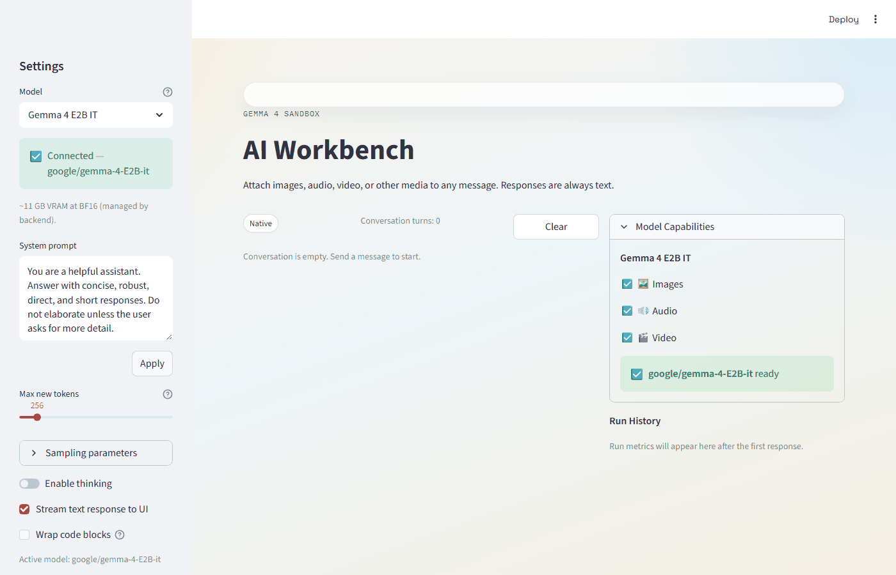

# AI Workbench

A local-first toolkit for serving and exploring multimodal AI models on your own hardware.

Wach this demo here:



Three independent components work together — or separately:

1. **Model Serving** — Run models locally and expose them as an API
2. **Sandbox UI** — Chat with your model: text, images, audio, video
3. **Playground** — Standalone scripts for benchmarks, load tests, and experiments

All communication flows through the [OpenAI-compatible API](https://platform.openai.com/docs/api-reference/chat/create) (`/v1/chat/completions`), so any client, tool, or script that speaks this protocol works out of the box.

---

## Table of Contents

- [At a Glance](#at-a-glance)
- [Model Serving](#model-serving)
  - [Option A: vLLM (Recommended)](#option-a-vllm-recommended)
  - [Option B: Windows-Native Transformers](#option-b-windows-native-transformers)
  - [Comparing the Two Backends](#comparing-the-two-backends)
  - [Performance Results (RTX 3090)](#performance-results-rtx-3090)
  - [Hardware Guide](#hardware-guide)
  - [Quantization](#quantization)
- [Sandbox UI](#sandbox-ui)
- [Playground](#playground)
- [Quick Start](#quick-start)
- [Running Tests](#running-tests)
- [Demo](#demo)
- [Future Ideas](#future-ideas)
- [Documentation Index](#documentation-index)
- [Appendix A: Supported Models](#appendix-a-supported-models)

---

## At a Glance

```
ai-workbench/
├── model-serving/      # FastAPI backend (Windows-native Transformers)
├── vllm-serving/       # vLLM launch scripts (WSL2 / Linux)
├── ui/                 # Streamlit chat UI
├── playground/         # Standalone benchmark and demo scripts
└── docs/               # Design docs, ADRs, research notes
```

Each folder has its own `requirements.txt` and `.env.example`. They share nothing at the Python level — no cross-imports, no shared virtualenv.

Three tested models are listed in [Appendix A](#appendix-a-supported-models) with HuggingFace IDs, multimodal capabilities, VRAM requirements, and backend compatibility. Any model [vLLM supports](https://docs.vllm.ai/en/latest/models/supported_models.html) can be served by passing its HuggingFace ID — see [Using other models](#appendix-a-supported-models).

---

## Model Serving

This is the core of the repo. Two backends serve the **same OpenAI-compatible API** on `http://localhost:8000`. The UI, playground scripts, and any external client work identically against either one.

### Option A: vLLM (Recommended)

**Best for:** production-like performance, Mistral models, benchmarks, multi-GPU setups.

vLLM brings PagedAttention (no OOM), continuous batching (concurrent users), native SSE streaming, and AWQ/GPTQ quantization. It runs inside **WSL2** (or native Linux) — it does not run natively on Windows.

**One-time setup:**

vLLM does not run on Windows — it needs a Linux environment. On Windows, [WSL2](https://learn.microsoft.com/en-us/windows/wsl/install) provides this. The `setup_vllm.sh` script creates a **separate Python virtualenv inside WSL2** (`~/vllm-env`) and installs vLLM with its own PyTorch+CUDA stack. This venv is completely isolated from your Windows venv — they must never be mixed.

```powershell
# Option 1 — from the repo root:
cd vllm-serving
wsl -e bash -c "chmod +x setup_vllm.sh && bash setup_vllm.sh"

# Option 2 — from anywhere (replace the path if your repo is elsewhere):
wsl -d Ubuntu-22.04 -- bash -c "cd /mnt/c/Users/$env:USERNAME/source/repos/ai-workbench/vllm-serving && bash setup_vllm.sh"
```

What it installs: vLLM 0.19+, PyTorch with CUDA, and transformers 5.5+ (overriding vLLM's `<5` pin for Gemma 4 compatibility). Re-running the script is safe — it reuses the existing venv and only upgrades packages.

**Start the server:**

```powershell
cd vllm-serving

# Default model (Gemma 4 E2B, from .env.vllm):
.\start_vllm.ps1

# Optional: override the model with -Model (see Appendix A for tested models)
.\start_vllm.ps1 -Model "google/gemma-4-E4B-it"
.\start_vllm.ps1 -Model "mistralai/Mistral-Small-3.1-24B-Instruct-2503"  # requires multi-GPU or A100+
```

The `-Model` parameter is **optional** — without it, vLLM loads whatever `MODEL_ID` is set in `.env.vllm` (default: Gemma 4 E2B). See [Appendix A](#appendix-a-supported-models) for tested models.

**Console output:**

```ini
# ========================================================
#   vLLM Model Server
# ========================================================
  Model        = mistralai/Mistral-Small-3.1-24B-Instruct-2503
  Host         = 0.0.0.0
  Port         = 8000
  Max tokens   = 8192
  VRAM util    = 0.90
  Dtype        = bfloat16
  Quantization = none
  TP size      = 1
  MM limit     = {"image": 10}
# ========================================================
  API    = http://0.0.0.0:8000/v1/chat/completions
  Health = http://0.0.0.0:8000/health
  Models = http://0.0.0.0:8000/v1/models
# ========================================================
```
```ini
                                        version 0.19.0
        █     █     █▄   ▄█
  ▄▄ ▄█ █     █     █ ▀▄▀ █   model  mistralai/Mistral-Small-3.1-24B-Instruct-2503
   █▄█▀ █     █     █     █
    ▀▀  ▀▀▀▀▀ ▀▀▀▀▀ ▀     ▀

INFO  Resolved architecture: PixtralForConditionalGeneration
INFO  Using max model len 8192
INFO  Asynchronous scheduling is enabled.
...
...
(APIServer pid=443) INFO:     Started server process [443]
(APIServer pid=443) INFO:     Waiting for application startup.
(APIServer pid=443) INFO:     Application startup complete.


```

**Configuration** lives in [`vllm-serving/.env.vllm`](vllm-serving/.env.vllm):

| Variable | Default | Purpose |
|---|---|---|
| `MODEL_ID` | `google/gemma-4-E2B-it` | HuggingFace model ID |
| `MAX_MODEL_LEN` | `8192` | Context window (lower = less VRAM) |
| `GPU_MEMORY_UTILIZATION` | `0.90` | Fraction of VRAM to use |
| `QUANTIZATION` | `none` | `none`, `awq`, `gptq` |
| `TENSOR_PARALLEL_SIZE` | `1` | Number of GPUs |

**Why auto-detection?** Mistral models need special vLLM flags (`--tokenizer_mode mistral`, `--config_format mistral`, `--load_format mistral`) that Gemma and other models don't. When `start.sh` sees "mistral" in the model ID, it adds these flags automatically so you don't have to remember them.

### Option B: Windows-Native Transformers

**Best for:** quick UI iteration on Windows, no WSL2 required, low setup friction.

Uses HuggingFace Transformers directly with a FastAPI shim that translates the internal inference engine into OpenAI-compatible endpoints.

**Start the server:**

```powershell
cd model-serving
.\start_server.ps1
```

**Console output:**

```ini
# 🚀 Starting Model Server
# ==================================================
# ✅ Loaded .env configuration
  Quantization  = DISABLED
  Torch Compile = ENABLED
  Memory Opt    = ENABLED
  Python path   = C:\...\model-serving\src

# 🌐 Starting FastAPI server on http://127.0.0.1:8000
#    Press Ctrl+C to stop the server
# ==================================================
```

**Configuration** lives in [`model-serving/.env`](model-serving/.env.example):

| Variable | Default | Purpose |
|---|---|---|
| `MODEL_ID` | `google/gemma-4-E2B-it` | HuggingFace model ID |
| `MODEL_QUANTIZE_4BIT` | `0` | NF4 quantization (text-only! see [Quantization](#quantization)) |
| `MODEL_TORCH_COMPILE` | `1` | PyTorch compilation |
| `MODEL_MAX_INPUT_TOKENS` | `8192` | Input truncation limit |
| `MODEL_GATEWAY` | `model` | `model` = real inference, `stub` = empty responses for testing |

The Windows backend also supports on-demand model switching via `POST /models/load` — the UI sidebar offers a "Load selected model" button when a different model is selected.

### Comparing the Two Backends

| Dimension | vLLM (WSL2 / Linux) | Windows-Native (Transformers) |
|---|---|---|
| **Setup** | WSL2 + separate venv | pip install in Windows venv |
| **Performance** | PagedAttention, continuous batching | Single-request, manual OOM guard |
| **Concurrent users** | Built-in batching | Serial queue |
| **Streaming** | Native SSE | Threaded SSE via shim |
| **Mistral support** | Official, correct (per Mistral AI) | "Not thoroughly tested" (per Mistral AI) |
| **Quantization** | AWQ, GPTQ built-in | BitsAndBytes NF4 only |
| **Multi-GPU** | Tensor parallelism | Not supported |
| **Adding new models** | Change `MODEL_ID`, restart | May need code changes |
| **Image understanding** | ✅ | ✅ (no quantization) |

**Recommendation:** Use vLLM on Linux or WSL2 for multi-user workloads, Mistral, or AWQ/GPTQ quantization. Use Windows-native on a powerful Windows GPU machine for full single-user inference without any Linux setup.

> Both backends serve identical endpoints: `POST /v1/chat/completions`, `GET /v1/models`, `GET /health`. The UI never knows which backend is running.

### Performance Results (RTX 3090)

All numbers measured on NVIDIA RTX 3090 (24 GB VRAM), April 2026, Gemma 4 E2B, no quantization, `bfloat16`.  
Benchmark scripts: `playground/vllm_benchmark.py` (vLLM) and `playground/native_benchmark.py` (native).  
Raw results: `playground/results.json`.

> Mistral Small 3.1 24B requires ~48 GB VRAM at full precision and could not be benchmarked on this machine.

#### vLLM Backend (WSL2, recommended)

| Scenario | Avg tok/s | TTFT | Latency |
|---|---|---|---|
| Text – short | 0.9 | 134 ms | 2.3 s |
| Text – medium (200 tok) | 49.0 | 43 ms | 4.1 s |
| Text – long (500 tok) | **74.7** | 37 ms | 6.7 s |
| Image via `file://` URI | 53.9 | 129 ms | 4.8 s |

vLLM uses PagedAttention, continuous batching, and CUDA graph capture. Media is served via `file://` URIs from the shared media folder — zero base64 encoding.

#### Windows-Native Backend (Transformers + OpenAI shim)

| Scenario | Avg tok/s | TTFT | Latency |
|---|---|---|---|
| Text – short | 0.4 | 394 ms | 2.5 s |
| Text – medium (200 tok) | 5.9 | 435 ms | 33.8 s |
| Text – long (500 tok) | 6.2 | 597 ms | 81.3 s |
| Image via local path | 6.9 | 35 s\* | 37.2 s |

\* TTFT includes image preprocessing in the Transformers pipeline (one-shot, no streaming during image decode).

#### Summary: vLLM vs Native

| Metric | vLLM | Native | Speedup |
|---|---|---|---|
| Text throughput (500 tok) | 74.7 tok/s | 6.2 tok/s | **~12×** |
| Image throughput | 53.9 tok/s | 6.9 tok/s | **~8×** |
| TTFT (text) | 37–43 ms | 394–597 ms | **~10×** |
| First image token | 129 ms | 35 s | **~270×** |

**Key insight:** vLLM's CUDA graph capture and PagedAttention deliver an order-of-magnitude improvement in both throughput and first-token latency. The shared-media `file://` architecture eliminates all base64 encoding overhead — images and video reach the model as raw file paths.

> Full methodology and raw JSON: `playground/results.json`

### Hardware Guide

#### Check Your GPU

```powershell
# Windows
Get-CimInstance Win32_VideoController | Select-Object Name, AdapterRAM

# Linux
nvidia-smi
```

```bash
# Verify PyTorch sees the GPU
python -c "import torch; print('CUDA:', torch.cuda.is_available(), '—', torch.cuda.get_device_name(0) if torch.cuda.is_available() else 'CPU')"
```

#### VRAM Requirements

| Model | BF16 VRAM | 4-bit VRAM | Fits RTX 3090? |
|---|---|---|---|
| Gemma 4 E2B | ~10 GB | ~2 GB | ✅ |
| Gemma 4 E4B | ~16 GB | ~5 GB | ✅ |
| Mistral Small 3.1 24B (BF16) | ~48 GB | — | ❌ multi-GPU or A100 |

#### Recommended Setups

| Budget | GPU | VRAM | What You Can Run |
|---|---|---|---|
| **Entry** | RTX 3060 | 12 GB | E2B at BF16, tight fit |
| **Sweet spot** | RTX 3090 / 4080 | 24 GB | E2B + E4B comfortably, Mistral AWQ |
| **Cloud** | T4 / L4 / A10G | 16–24 GB | E2B or E4B, spot instances ~$0.50–$1/hr |
| **Production** | A100 / H100 | 40–80 GB | Any model, multi-user serving |

> No manual GPU flags needed. Both backends auto-detect CUDA and use `device_map="auto"` with `bfloat16`.

### Quantization

Quantization compresses model weights from 16-bit to 4-bit precision, reducing VRAM by roughly 4× — for example, a 48 GB model can shrink to ~14 GB and fit on a consumer GPU.

#### Pre-quantized models via vLLM

Many models on [HuggingFace Hub](https://huggingface.co/models) are available in pre-quantized formats (search for the model name + "AWQ" or "GPTQ"). vLLM can load these directly:

1. Find a quantized variant on HuggingFace
2. Set `QUANTIZATION=awq` (or `gptq`) in `.env.vllm`
3. Pass the model ID: `start_vllm.ps1 -Model "org/model-name-AWQ"`

> **Caveat:** Community-quantized models vary in quality. Some have broken tokenizer data or missing files that produce garbage output. Always test before relying on one.

#### NF4 via BitsAndBytes (Windows-native only)

> **⚠️ CRITICAL: NF4 quantization destroys image/multimodal understanding.**
>
> With `MODEL_QUANTIZE_4BIT=1`, the model **cannot see images at all**. It will say "Please provide an image" or hallucinate nonsense ("Pepsi", "ESPN") instead of describing the actual picture. Confirmed on both Gemma 4 E2B and Mistral Small 3.1.
>
> **Only use for pure text workloads on GPUs with <12 GB VRAM.**

Set `MODEL_QUANTIZE_4BIT=1` in `model-serving/.env`. Reduces VRAM ~4× (E2B: 10 GB → 2 GB).

---

## Sandbox UI

A [Streamlit](https://github.com/streamlit/streamlit) chat interface for interacting with whatever model the backend is serving. The UI has zero model dependencies — just HTTP calls via the OpenAI Python SDK.

**Start:**

```powershell
cd ui
$env:PYTHONPATH = "src"
streamlit run app.py
```

Opens at `http://localhost:8501`. Connects to the backend at `http://localhost:8000` (configurable via `MODEL_SERVING_URL` in `ui/.env`).

### Features

- **Multimodal chat** — Attach images (upload, URL, or clipboard paste), audio, or video to any message
- **Multi-turn conversation** — Full history sent to the model on every request; follow-up questions work naturally
- **Model switching** — Dropdown with registered models; Windows-native backend supports hot-swap
- **Sampling controls** — Temperature, top-p, top-k, max tokens — all adjustable in the sidebar
- **Streaming** — Token-by-token output via SSE, with toggle for one-shot mode
- **Run metrics** — Per-turn timing, token counts, tok/s, VRAM usage, cold-start detection
- **System prompt** — Free-form text area; no preset personas
- **Code block handling** — Horizontal scroll by default, with a "Wrap code blocks" toggle

The UI is **model-agnostic**. It reads capabilities (image/audio/video support) from a model registry and gates media input controls accordingly. Adding a new model requires one entry in `model_profiles.py` — nothing else changes.

---

## Playground

Standalone scripts for benchmarking, load testing, and quick experiments. No dependency on the UI or model-serving packages.

| Script | Purpose |
|---|---|
| `vllm_benchmark.py` | **vLLM benchmark** — text (short/medium/long) + image via `file://` URI; saves JSON results |
| `native_benchmark.py` | **Native benchmark** — same scenarios against Windows Transformers backend |
| `benchmark_runner.py` | Sequential benchmark harness with warmup, timing stats, JSON scenarios |
| `load_test.py` | Concurrent load testing (10–500+ users, async HTTP, ramp-up, SLA checks) |
| `concurrency_simulation.py` | Mathematical capacity modeling (users × request rate × latency) |
| `vllm_gemma4.py` | vLLM smoke test for Gemma 4 (client + offline modes) |
| `vllm_mistral.py` | vLLM smoke test for Mistral Small 3.1 AWQ |
| `gemma4_text_demo.py` | Standalone Transformers text demo — one file, zero project deps |

### Load Testing Example

```powershell
cd playground

# Light load (10 users, 60 seconds)
python load_test.py load_scenarios.json --concurrent-users 10 --duration 60

# Production stress test
python load_test.py production_load_scenarios.json --concurrent-users 100 --ramp-up 30
```

```
🏁 LOAD TEST RESULTS
================================================================================
📊 medium-load-e2b (Gemma 4 E2B)
   👥 Concurrent Users: 25    ⏱️ Duration: 120s
   📈 Total Requests: 245     ✅ Success Rate: 98.4%
   🚀 Requests/sec: 2.04      ⚡ Avg Latency: 4.126s
   📊 P50/P95/P99: 3.892s / 7.234s / 9.156s
```

### Capacity Simulation Example

```powershell
python concurrency_simulation.py --registered-users 100 --active-request-rate 0.1 --multimodal-share 0.2
```

> Full docs: [playground/README.md](playground/README.md) · Detailed results: [docs/benchmarks.md](docs/benchmarks.md)

---

## Quick Start

### Prerequisites

- Python 3.11+
- NVIDIA GPU with CUDA (for GPU inference)
- WSL2 with Ubuntu (for vLLM only)

### 1. Create a Windows venv (model-serving + UI)

```powershell
python -m venv venv
venv\Scripts\Activate.ps1

# CUDA-enabled PyTorch (skip for CPU-only)
pip install torch torchvision --index-url https://download.pytorch.org/whl/cu124

# Project dependencies
pip install -r model-serving/requirements.txt
pip install -r ui/requirements.txt
```

### 2. Configure

```powershell
copy model-serving\.env.example model-serving\.env
# Edit .env: set MODEL_GATEWAY=model for real inference (default is "stub")

copy ui\.env.example ui\.env
# Defaults work — edit only if backend isn't at localhost:8000
```

### 3. Start

The two backends are **alternatives** — run one or the other, not both. They both serve on port 8000.

**Option A — Windows-native** (no WSL2 needed):

```powershell
# Terminal 1:
cd model-serving
.\start_server.ps1
```

**Option B — vLLM via WSL2** (better performance, requires [one-time WSL2 setup](#option-a-vllm-recommended)):

```powershell
# Terminal 1:
cd vllm-serving
.\start_vllm.ps1                        # loads default model from .env.vllm
.\start_vllm.ps1 -Model "org/model-id"  # optional (see Appendix A)
```

Use `-Model` to override the default. See [Appendix A](#appendix-a-supported-models) for tested model IDs.

Then, in a separate terminal, start the UI:

```powershell
# Terminal 2:
cd ui
$env:PYTHONPATH="src"
streamlit run app.py
```

### WSL2 venv (vLLM only — separate from Windows)

```powershell
# Option 1 — from the repo root:
cd vllm-serving
wsl -e bash -c "chmod +x setup_vllm.sh && bash setup_vllm.sh"

# Option 2 — from anywhere (replace the path if your repo is elsewhere):
wsl -d Ubuntu-22.04 -- bash -c "cd /mnt/c/Users/$env:USERNAME/source/repos/ai-workbench/vllm-serving && bash setup_vllm.sh"
```

> **Never install vLLM in the Windows venv.** It pins `transformers<5.0`, which breaks model-serving.

---

## Running Tests

```powershell
# All 45 tests (31 model-serving + 14 UI)
$env:PYTHONPATH = "model-serving\src;ui\src"
python -m pytest model-serving/tests/ ui/tests/ -v
```

Tests use fakes and mocks — no GPU or model weights required.

---

## Future Ideas

Collected from research notes, tasks, and daily use:

- **Token-by-token streaming for multimodal** — Currently, image/audio/video requests use one-shot generation; true SSE streaming would improve perceived latency
- **Run history persistence** — Save past conversations and metrics to disk for later review
- **Prompt presets library** — Curated system prompts for common tasks (product descriptions, code review, image analysis)
- **Flash Attention 2 on Windows** — Would remove the input token limit concern entirely, but `flash-attn` has no prebuilt Windows wheels (Linux/WSL2 only)
- **Structured output modes** — JSON schema enforcement for attribute extraction, listing generation
- **Async image analysis** — Queue multimodal requests as background jobs (2–3× slower than text-only)
- **Response caching** — Avoid re-running identical requests (the FastAPI blueprint includes a cache design)
- **Cost-of-goods tracking** — Per-request infrastructure cost computation for budget planning
- **vLLM continuous batching benchmarks** — Compare vLLM concurrent throughput vs Windows-native serial queue on the same hardware
- **Multi-GPU tensor parallelism** — vLLM supports this natively; untested in this repo
- **Production deployment guide** — Load balancer, job queue, and multi-worker topology for real multi-user serving

---

## Documentation Index

| Document | Purpose |
|---|---|
| [docs/START_HERE.md](docs/START_HERE.md) | Project entrypoint for AI agents and new contributors |
| [docs/tasks.md](docs/tasks.md) | Task tracking and phase status |
| [docs/design/design.md](docs/design/design.md) | Architecture, key decisions, capability boundaries |
| [docs/benchmarks.md](docs/benchmarks.md) | Performance results, load testing, capacity planning |
| [docs/research/gemma4-serving-evaluation.md](docs/research/gemma4-serving-evaluation.md) | Model selection and serving research |
| [docs/research/low-cost-fastapi-blueprint.md](docs/research/low-cost-fastapi-blueprint.md) | Queue-first FastAPI serving design |

---

## Appendix A: Supported Models

These models are tested and registered in the UI dropdown. Pass any HuggingFace ID to `start_vllm.ps1 -Model` to try others.

| Model | HuggingFace ID | Image | Audio | Video | VRAM (BF16) | vLLM | Windows-Native |
|---|---|---|---|---|---|---|---|
| **Gemma 4 E2B IT** | `google/gemma-4-E2B-it` | ✅ | ✅ | ✅ | ~11 GB | ✅ | ✅ |
| **Gemma 4 E4B IT** | `google/gemma-4-E4B-it` | ✅ | ✅ | ✅ | ~18 GB | ✅ | ✅ |
| **Gemma 4 26B A4B IT** | `google/gemma-4-26B-A4B-it` | ✅ | ❌ | ✅ | ~52 GB | ✅ | ✅ |
| **Gemma 4 31B IT** | `google/gemma-4-31B-it` | ✅ | ❌ | ✅ | ~62 GB | ✅ | ✅ |
| **Mistral Small 3.1 (24B)** | `mistralai/Mistral-Small-3.1-24B-Instruct-2503` | ✅ | ❌ | ❌ | ~48 GB | ✅ | ✅ |
| **Mistral Small 4 (119B)** ¹ | `mistralai/Mistral-Small-4-119B-2603` | ✅ | ❌ | ❌ | ~238 GB | ✅ | ✅ |

<sup>¹ Mistral Small 4 is registered but disabled in the UI dropdown until verified. Models requiring >24 GB VRAM need multi-GPU (tensor parallelism) or A100/H100 class GPUs.</sup>

> **Gemma 4 naming**: The "E" prefix means **Effective** — Gemma 4 uses Mixture of Experts (MoE), where only a fraction of parameters are active per token. "E2B" = 2.3B active params / 5.1B total stored.

### Using other models

All models are downloaded from [HuggingFace Hub](https://huggingface.co/models). You can serve **any model vLLM supports** by passing its HuggingFace ID:

```powershell
.\start_vllm.ps1 -Model "org/model-name"
```

Community-quantized variants (AWQ, GPTQ) can dramatically reduce VRAM requirements — search HuggingFace for `<model-name> AWQ`. Always test output quality before relying on a quantized repack, as they vary in reliability.

---

## License

See repository for license details.
